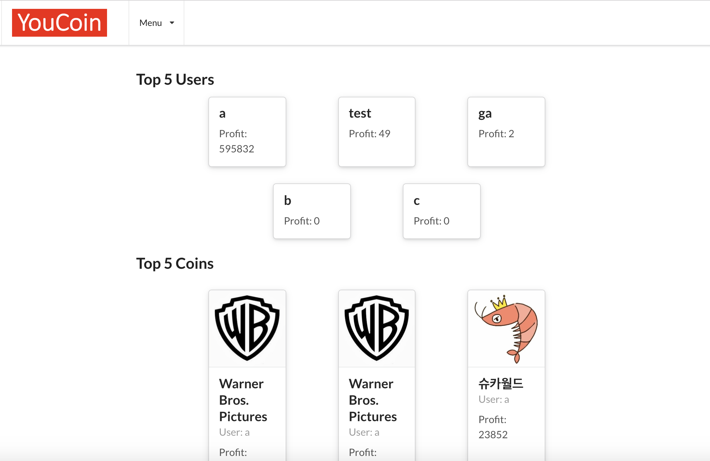
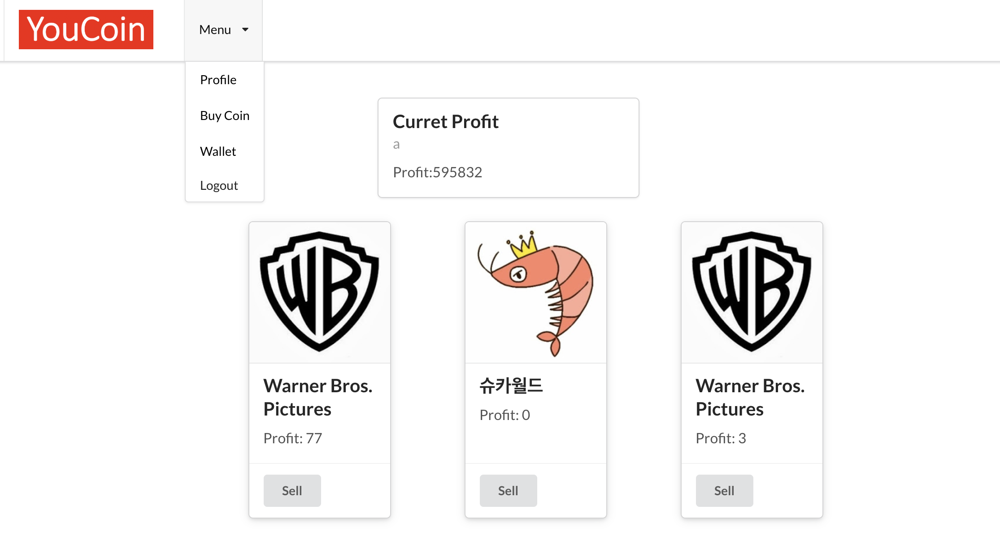

# YouCoin
> Applying values to our YouTube experience

## Table of contents
* [General info](#general-info)
* [Screenshots](#screenshots)
* [Technologies](#technologies)
* [Setup](#setup)
* [Features](#features)
* [Status](#status)
* [Inspiration](#inspiration)
* [Contact](#contact)

## General info
The act of subscribing in YouTube carries important meanings to users. By subscribing specific YouTubers, users feel like they are supporting them which they take pride of. When the YouTuber becomes more and more influencial after you become the fan of him/her, users feel they have insights.

YouCoin records the changes in the number of subscribers of the YouTuber after the use subscribes to him/her. YouCoin aims to activate YouTube fandom culture even more by helping users to validate their insights and choices.

## Screenshots

### Main


### Wallet


## Technologies
* JavaScript
* React
* Python
* Flask
* HTML5
* CSS3
* Semantic UI React
* SQLite
* API

## Setup
Link to the 
[Website](https://https://github.com/benoh0906/) 


Link to the 
[Frontend](https://github.com/benoh0906/youcoin_flask_backend)

To locally install YouCoin, please download sourcescode for the frontend.

The app requires Google API key to properly function. In the directory /api/, and the file api.py, please type your own API key.

```
api=Blueprint('api','api',url_prefix="/api/v1")
key = "YOUR KEY"

```


## Code Examples

Creating coins by using Google API fetch call and saving the data in SQL file:

```
@api.route('/', methods = ["POST"])
def create_youcoins():
    payload = request.get_json()
    
    user = models.User.get(models.User.id== payload['user'])
    
    url=payload["channelUrl"]
    
    for i in range(len(url)):
        if url[i:i+8]=="channel/":
            name=url[i+8:]

        elif url[i:i+5]=="user/":
            userFind=url[i+5:]
            subdata= urllib.request.urlopen("https://www.googleapis.com/youtube/v3/channels?part=statistics&forUsername="+userFind+"&key="+key).read()
            name=json.loads(subdata)["items"][0]["id"]
            print(name,"user name")
    
    data= urllib.request.urlopen("https://www.googleapis.com/youtube/v3/channels?part=snippet%2CcontentDetails%2Cstatistics&id="+name+"&key="+key).read()
    subs = json.loads(data)["items"][0]["statistics"]["subscriberCount"]
    title = json.loads(data)["items"][0]["snippet"]["title"]
    pic = json.loads(data)["items"][0]["snippet"]["thumbnails"]["medium"]["url"]
    youcoin = models.Youcoin.create(
        user=user.id, 
        channelUrl=payload['channelUrl'],
        channelTitle= title,
        channelId = name,
        startingNum = int(subs),
        currentNum = int(subs),
        profit = 0,
        channelPic=pic
        )


    you_dict = model_to_dict(youcoin)

    return jsonify(data = you_dict, status={"code":281,"message":"Success"})
    
```

Query through the database in a given order:

```

@api.route('/main', methods = ["GET"])
def rank_youcoin():

    youcoins=[model_to_dict(youcoin) for youcoin in models.Youcoin.select().order_by(models.Youcoin.profit.desc()).limit(5)]

    return jsonify(data=youcoins, status={"code":200,"message":"success"})

              
```

## Features
List of features ready and TODOs for future development

* Create, edit, and delete a user account
* Buy/Sell Coin assisted by YouTube API
* Coin/User Ranking 

To-do list:

* Statistics and graphs of coin values
* Re-design of the website UI

## Status
Project is: _in progress_


## Inspiration
Project inspired by YouTube.

## Contact

Created by Jungbin Oh

Email: benoh0906@gmail.com

Social:

* [GitHub](https://https://github.com/benoh0906/) 

* [LinkedIn](https://www.linkedin.com/in/jungbinoh/)

